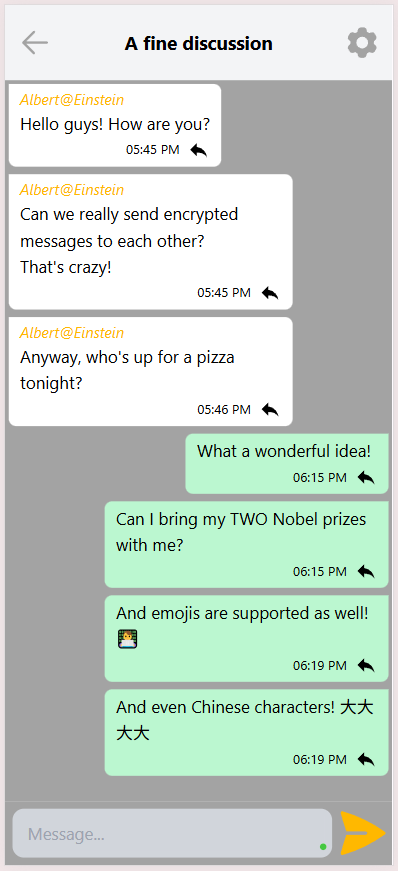
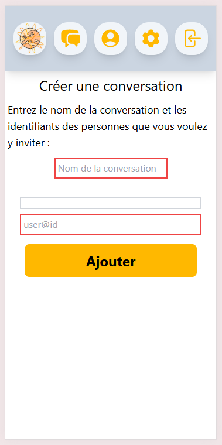
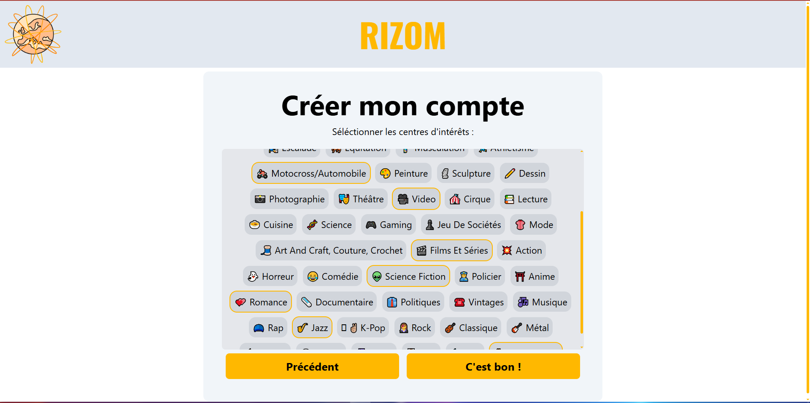
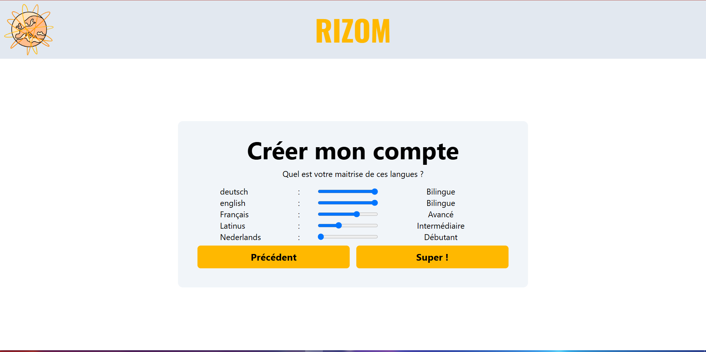
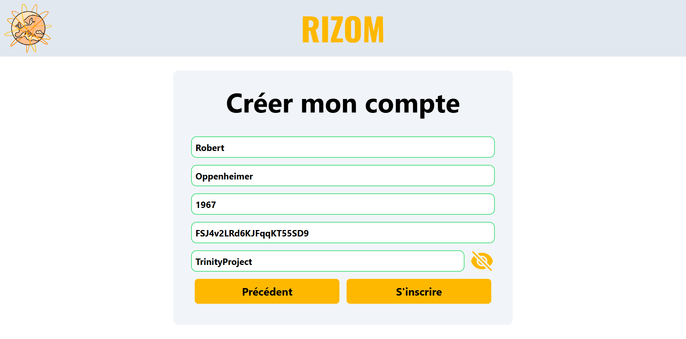
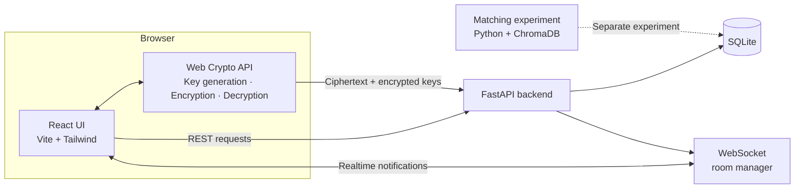
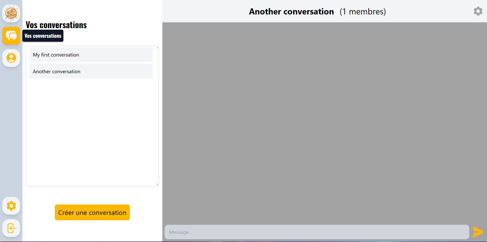

<p align="center">
  
</p>

<h1 align="center">Rizom</h1>

<p align="center">
  <strong>A full-stack social platform prototype designed to connect students across international partner schools.</strong>
</p>

<p align="center">
  React · FastAPI · SQLite · WebSockets · Web Crypto API · Python
</p>

> **Status — historical prototype (2022–2023).** Rizom reached a functional alpha stage but was never released as a public beta or deployed as a production service. This repository is a cleaned archival version of the original project.

<p align="center">
  
</p>

<p align="center">
  <em>Desktop messaging interface from the functional prototype. The original UI is in French because Rizom was developed as a French high-school project.</em>
</p>

---

## At a glance

|                          |                                                                                         |
| ------------------------ | --------------------------------------------------------------------------------------- |
| **Period**               | 2022–2023                                                                               |
| **Context**              | Student-led high-school project                                                         |
| **Team**                 | ~15 students                                                                            |
| **My role**              | Co-initiator, technical lead and principal developer                                    |
| **Core system**          | React frontend + FastAPI backend + SQLite                                               |
| **Technical highlights** | Client-side encrypted messaging, realtime WebSocket notifications, matching experiments |
| **Outcome**              | Functional prototype presented to the final project jury                                |
| **External interest**    | Around 10 partner schools expressed interest in a potential future rollout              |
| **Production status**    | No public beta, no production deployment, no real production users                      |

## What was Rizom?

Rizom started from a simple idea: students at partner schools in different countries had few practical ways to meet each other outside formal exchange programs.

The project aimed to build a private social platform where students could:

* join through registration codes distributed by participating institutions;
* create a profile with their languages and interests;
* discover potentially compatible students;
* create private conversations;
* exchange messages in realtime;
* use a messaging architecture where message encryption and decryption happened in the browser.

The broader project went beyond software development. The team also worked on visual design, privacy and legal questions, communication material, and outreach to potential partner schools.

Around ten institutions had expressed interest in participating in a future rollout. The project stopped before such a rollout took place, when the founding students left the school and no successor team continued its development.

### Why is the interface in French?

Rizom was developed as a school project in France, and the original prototype was primarily designed and demonstrated in that context. The user interface was therefore written in French.

The repository and its technical documentation are now presented in English to make the project accessible to a broader international audience, but the original interface has intentionally been preserved rather than rewritten for this archive.

## What was actually implemented?

The distinction between the integrated alpha and standalone experiments is important.

| Feature                                     | Status                   |
| ------------------------------------------- | ------------------------ |
| Registration-code onboarding                | ✅ Integrated             |
| User accounts and authentication            | ✅ Integrated             |
| Language and interest preferences           | ✅ Integrated             |
| Conversation creation and member invitation | ✅ Integrated             |
| Conversation history                        | ✅ Integrated             |
| Client-side message encryption/decryption   | ✅ Integrated             |
| Realtime conversation updates               | ✅ Integrated             |
| Reply-to-message support                    | ✅ Integrated             |
| Responsive desktop/mobile interface         | ✅ Integrated             |
| Interest/language matching                  | 🧪 Standalone experiment |
| Public production deployment                | ❌ Never deployed         |
| Public beta / real production users         | ❌ Never launched         |

The matching work is therefore documented in this repository as an **experiment**, not presented as a feature that was fully integrated into the final application.

## My role

I co-initiated Rizom and acted as its **technical lead and principal developer**.

Within a team of roughly 15 students, I was responsible for most of the software work, including:

* designing a large part of the application architecture;
* implementing most of the frontend and backend;
* designing the REST API and data model;
* implementing conversation and messaging logic;
* building the browser-side cryptographic layer;
* implementing realtime notifications with WebSockets;
* developing and evaluating the matching prototype;
* making the main technical choices as the project evolved.

Other members of the team contributed to areas such as product definition, design, communication, legal/privacy research and partner-school outreach.

<p align="center">
  
  <br>
  
  <br>
  
  
</p>

## Architecture

The final prototype used a fairly small full-stack architecture:



### Application flow

The frontend is responsible for both the user interface and the client-side cryptographic operations.

The FastAPI backend handles:

* authentication checks;
* users and registration codes;
* conversation membership and metadata;
* encrypted message storage;
* encrypted conversation-key distribution;
* realtime notifications.

Messages themselves are sent through the REST API. After storing a new encrypted message, the backend broadcasts a small WebSocket `new-message` notification to clients subscribed to that conversation. Those clients can then retrieve and decrypt the new content.

SQLite provides the persistent application state.

The matching prototype was developed separately and was not wired into the final alpha.

## Client-side encrypted messaging

One of the most technically interesting parts of Rizom was exploring how private conversations could be designed without storing plaintext message content on the server.

The final prototype implemented the following scheme using the browser's **Web Crypto API**.

### 1. User keys

When a user registers, the browser generates a **2048-bit RSA-OAEP key pair using SHA-256**.

The public key can be stored directly by the backend.

The private key is exported in the browser and protected using the user's password before being sent to the server:

```text
User password
     │
     ▼
PBKDF2-SHA256
100,000 iterations
     │
     ▼
AES-256-CTR key
     │
     ▼
Encrypt RSA private key
```

A fresh random salt and counter are generated when creating an encrypted bundle.

The backend therefore stores the private key only in encrypted form.

### 2. Conversation keys

When a conversation is created, the browser generates a random **256-bit conversation secret**.

For each participant:

```text
Conversation secret
        │
        ├── RSA-OAEP(public key of Alice) ──► Alice's encrypted copy
        │
        ├── RSA-OAEP(public key of Bob)   ──► Bob's encrypted copy
        │
        └── RSA-OAEP(public key of Carol) ──► Carol's encrypted copy
```

Each participant therefore receives a version of the conversation secret encrypted with their own RSA public key.

The backend stores these encrypted copies rather than the conversation secret in plaintext.

### 3. Messages

Before a message leaves the browser, its content is encrypted using key material derived from the conversation secret.

The backend receives and stores the resulting ciphertext.

When opening a conversation, the client:

1. retrieves its encrypted conversation key;
2. decrypts it using the user's private RSA key;
3. retrieves the encrypted messages;
4. decrypts them locally.

```text
Plaintext
   │
   │ browser
   ▼
Encrypt
   │
   ▼
Ciphertext ──► FastAPI ──► SQLite
   │
   │ network / server
   ▼
Ciphertext ──► browser ──► decrypt ──► Plaintext
```

### Security note

This was an **educational prototype designed in 2022–2023**, not a production secure-messaging protocol.

The implementation was never independently audited and intentionally makes no claim of production-grade security. In particular, it does not implement several properties expected from modern secure messaging systems, including:

* authenticated encryption;
* independent public-key verification;
* forward secrecy;
* key ratcheting;
* a production-grade authentication protocol.

For that reason, I describe the project as implementing **client-side encrypted messaging**, rather than making claims such as "Signal-like security" or presenting it as a production-ready end-to-end encryption system.

The interesting part of this work was the architecture and the exploration of key management, not the claim that the resulting protocol was suitable for real-world secure communications.

## Matching experiment

Rizom was also intended to help students discover people with whom they shared languages and interests.

I explored this separately from the main application before integrating such a system.

The experiment represents profiles using:

* up to **200 possible interests**;
* **10 possible languages**;
* binary vector representations for similarity search.

A simpler compatibility function first checks whether two users share a minimum number of languages and interests.

A second experiment uses **ChromaDB** to explore vector similarity search on synthetic user populations.

The included benchmark generates:

```text
50,000 synthetic users
        │
        ▼
Interest + language vectors
        │
        ▼
ChromaDB collection
        │
        ▼
Nearest-neighbour query
        │
        ▼
1,000 candidate matches
```

The goal was not to build a sophisticated recommendation model, but to test whether vector-based retrieval could provide a practical first stage for matching at the scale we were considering.

This remained an **experimental component** and should not be confused with an integrated production matching feature.

## Tech stack

### Frontend

* **JavaScript**
* **React 18**
* **Vite**
* **Tailwind CSS**
* **React Router**
* **Web Crypto API**
* WebSocket client

### Backend

* **Python**
* **FastAPI**
* **Pydantic**
* **aiosqlite**
* **SQLite**
* **MessagePack**
* WebSockets

### Matching experiment

* **Python**
* **ChromaDB**
* Synthetic data generation and vector similarity queries

## Responsive interface

The React frontend includes dedicated responsive behaviour for both desktop and mobile layouts.

<p align="center">
  
  
</p>

## Project status

Rizom should be understood as a substantial **functional prototype**, not as a launched startup.

What happened:

* the project was developed during the 2022–2023 school year;
* a working alpha prototype was built;
* the prototype was demonstrated and presented to the project's final jury;
* the team contacted schools in several countries;
* around ten institutions expressed interest in a possible future participation;
* no public beta was launched;
* no production server infrastructure was deployed for real users;
* the project stopped when the founding students left the school and no successor team took it over.

During the archival cleanup of this repository, the application was restored and smoke-tested locally. The tested flows included:

* database initialization;
* signup;
* login;
* profile preferences;
* conversation loading;
* conversation creation;
* encrypted message round-trips;
* realtime WebSocket notifications;
* the standalone matching experiment.

The goal of this repository is therefore to preserve and document the engineering work, rather than to revive Rizom as an active product.

## Running locally

> The historical demo database is deliberately **not included** in this repository. It contained legacy test data and cryptographic material that should not be published.

### Backend

From `backend/`:

```bash
python -m pip install -r requirements.txt
```

Create an empty SQLite database from the schema:

```bash
python -c "import sqlite3, pathlib; db=sqlite3.connect('sqlite3_database.db'); db.executescript(pathlib.Path('create_table.sql').read_text()); db.close()"
```

Run the API:

```bash
python -m uvicorn API:app --reload --reload-exclude "*.db-journal"
```

The API should then be available at:

```text
http://127.0.0.1:8000
```

FastAPI's interactive documentation is available at:

```text
http://127.0.0.1:8000/docs
```

> **WebSocket note:** the prototype's room manager is stored in process memory. Run the backend with a **single Uvicorn worker**; multiple workers do not share WebSocket subscription state.

### Create a local registration code

A fresh database contains no users or registration codes.

Run the following command from `backend/` to generate one registration code:

```bash
python -c "import sqlite3, uuid, time, shortuuid; u=uuid.uuid4(); db=sqlite3.connect('sqlite3_database.db'); db.execute('INSERT INTO registrationcodes (code_uuid, delivered_by, delivered_at) VALUES (?, ?, ?)', (str(u), 'local-dev', time.time())); db.commit(); db.close(); print(shortuuid.encode(u))"
```

Use the printed code in the signup interface.

Run the command again if you want to create a second account for testing conversations.

### Frontend

From `frontend/`:

```bash
npm install
npm run dev
```

By default, the archived configuration targets the local API and WebSocket server.

If needed, they can be overridden using Vite environment variables:

```text
VITE_API_URL=http://127.0.0.1:8000
VITE_WS_API_URL=ws://127.0.0.1:8000
```

Open the URL printed by Vite, typically:

```text
http://localhost:5173
```

## Repository structure

```text
rizom/
├── frontend/
│   ├── public/
│   ├── src/
│   └── package.json
│
├── backend/
│   ├── API.py
│   ├── database_interface.py
│   ├── model.py
│   ├── websockets_lib.py
│   ├── create_table.sql
│   └── requirements.txt
│
├── experiments/
│   └── matching/
│       ├── generate_mock_data.py
│       ├── lib.py
│       ├── main.py
│       └── requirements.txt
│
├── docs/
│   └── screenshots/
│
├── .gitignore
├── LICENSE
└── README.md
```

## About this archive

The original project was split across several repositories and accumulated development artifacts over time.

The objective of the cleanup was deliberately limited:

* preserve the original architecture and engineering decisions;
* remove historical databases, sensitive data and development artifacts;
* remove obviously unused or misleading code;
* fix only small issues required to run the prototype again;
* document what was actually implemented;
* clearly separate integrated features from experiments.

It is **not** a 2026 rewrite of the application.

The technologies, architectural choices and limitations largely reflect the project as it existed in 2023.

---

<p align="center">
  <strong>Built in 2022–2023 · Archived and documented in 2026</strong>
</p>
